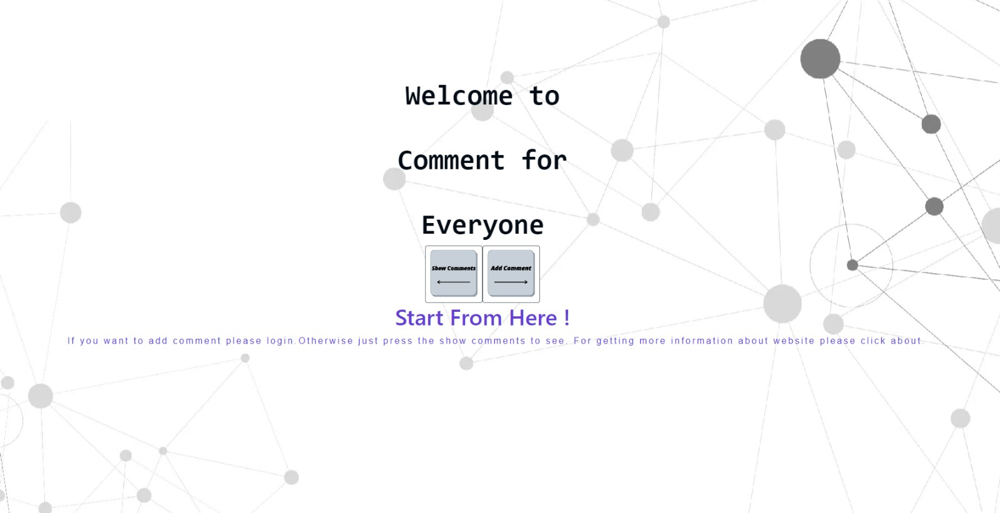
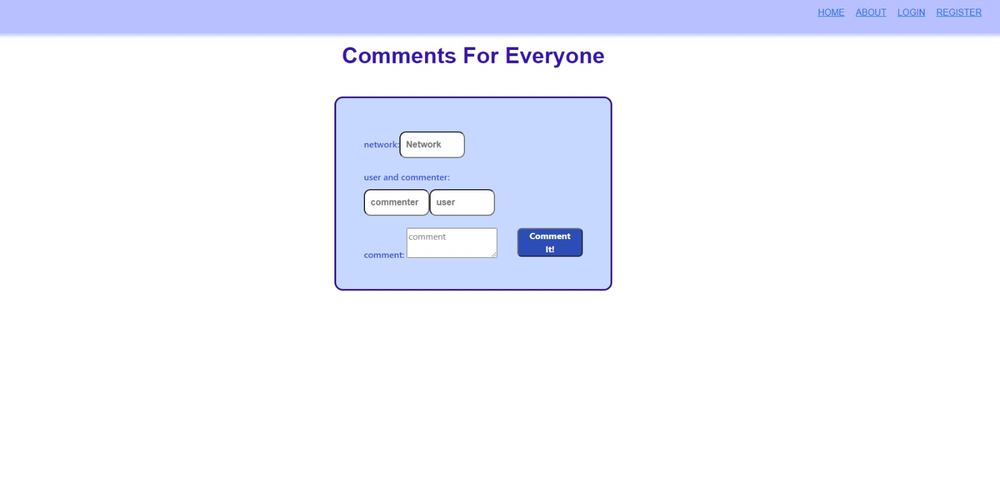
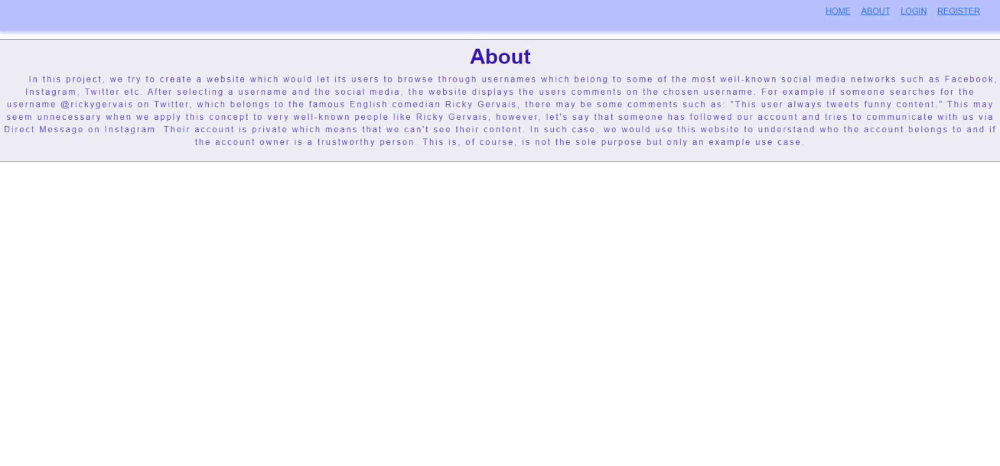
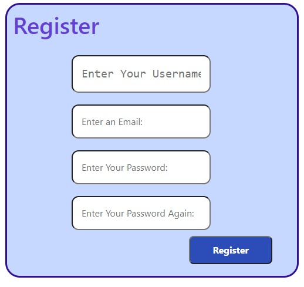

# CS391-20_21-Spring
This repository is the codebase for CS391 Web Development Class at Ozyegin University 2020 2021 Spring term

For this project Peker Celik, Yigit Demirsan, Betul Seyhan and Egemen Iscan worked as team member. 

In this project, we try to create a website which would let its users to browse through usernames which belong to some of the most well-known social media networks such as Facebook, Instagram, Twitter.After selecting a username and the social media, the website displays the users comments on the chosen username. For example if someone searches for the username @rickygervais on Twitter, which belongs to the famous English comedian Ricky Gervais, there may be some comments such as: "This user always tweets funny content." This may seem unnecessary when we apply this concept to very well-known people like Ricky Gervais, however, let's say that someone has followed our account and tries to communicate with us via Direct Message on Instagram. Their account is private which means that we can't see their content. In such case, we would use this website to understand who the account belongs to and if the account owner is a trustworthy person. This, of course, is not the sole purpose but only an example use case.

Each member's responsibilities are distributed equally. Yigit Demirsan has converted all the HTML code to React. Nebi Peker Celik has worked on the API, and on the flow of the website. Betul Seyhan has worked on the routers, containers and the components. Egemen Iscan also mainly worked on the containers, especially on the login part. On the other hand we all have worked together to solve challenging problems, share ideas, participate in pair programming and we made our best to assist each other whenever possible.Now that we have explained the main goal of this project, let's take a look at the screenshots directly taken from the website. These screenshots serve as a user guide...

How Can We Use It?
When you open the website you show the Home page. There are two buttons. If you click the button which is called Add Comment you will be routed to Register. If you are already registered, you can choose the Login button and if you login you can use the Add Comment. Otherwise, when you click Show Comments you can see all the comments added without Register or Login.

...
 

