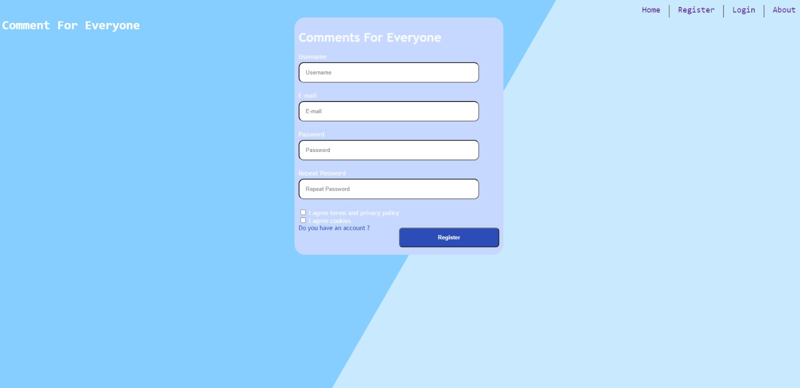
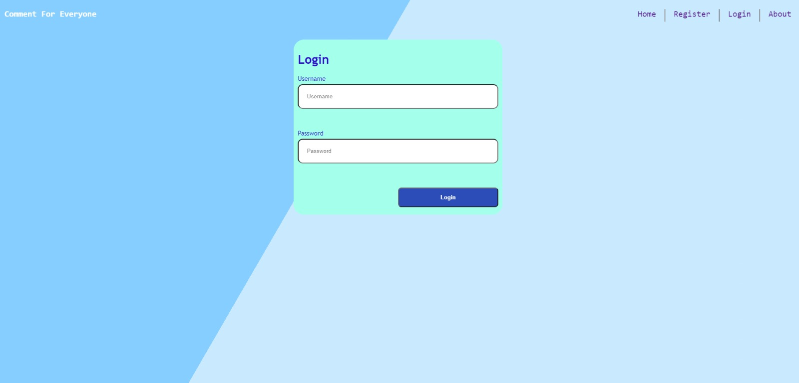
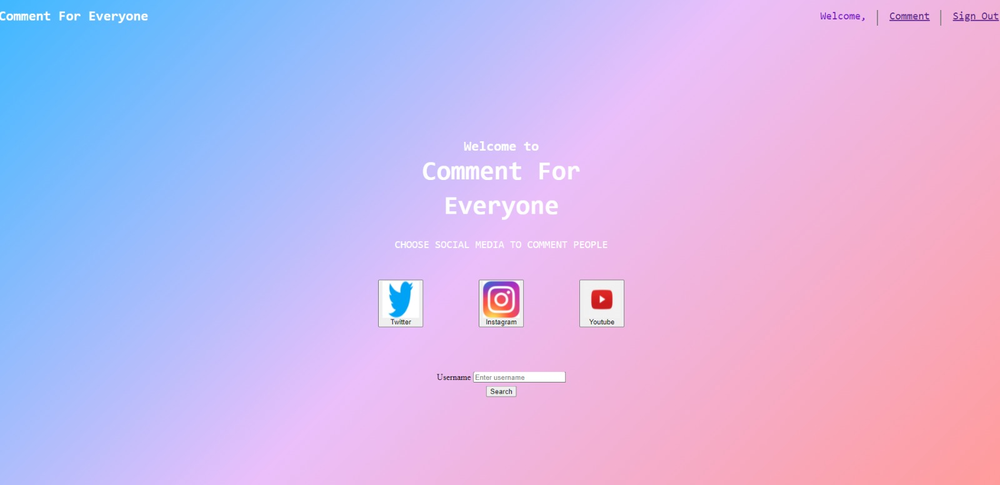

# CS391-20_21-Spring
This repository is the codebase for CS391 Web Development Class at Ozyegin University 2020 2021 Spring term

For this project Peker Celik,Yigit Demirsan,Betul Seyhan and Egemen Iscan worked as team member. 

In this project, we try to create a website which would let its users to browse through usernames which belong to some of the most well-known social media networks such as Facebook, Instagram, Twitter.After selecting a username and the social media, the website displays the users comments on the chosen username. For example if someone searches for the username @rickygervais on Twitter, which belongs to the famous English comedian Ricky Gervais, there may be some comments such as: "This user always tweets funny content." This may seem unnecessary when we apply this concept to very well-known people like Ricky Gervais, however, let's say that someone has followed our account and tries to communicate with us via Direct Message on Instagram. Their account is private which means that we can't see their content. In such case, we would use this website to understand who the account belongs to and if the account owner is a trustworthy person. This is, of course, is not the sole purpose but only an example use case.

We did not use additional libaries because we use make all functionalities by using javascript.

Each member's responsibilities are distributed equally.Yigit Demirsan especially worked on the html part of the main_page and some part of the css;for login_page some css part and js;for register page some part of the html,js and css parts.Betul Seyhan worked on especially register page html and some part of css and js part;for login_page work on some css ,html and js part;for comment page work on css.Peker Celik especially worked on comments js and html also worked on login css,html and js;for register_page looked js parts.Egemen Iscan especially worked on result page css,html and js part,also entire about page and search bar on the main page and buttons colour change.On the other hand we all have worked together to solve challenging  problems ,gets ideas each other,make pair programming and we help each other all page css,html and js.

Now that we have explained the main goal of this project, let's take a look at the screenshots directly taken from the website. These screenshots serve as a user guide...

 

